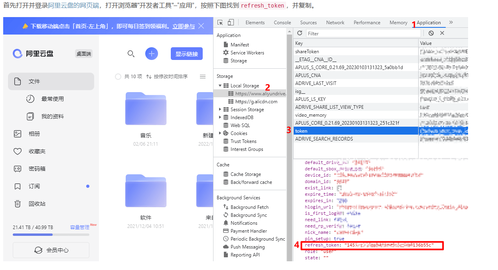

<div align="center">
<h1 align="center">签到助手</h1>


</div>
该项目使用springboot作为框架整合各类应用签到，如百度贴吧签到、哔哩哔哩、网易云音乐、阿里云网盘等。

默认每日 04:01 开始每日签到任务,要修改请更改config/appconfig.yml内的scheduled.cron值

### 功能介绍

#### 百度贴吧

- 贴吧签到

#### 哔哩哔哩

- 观看分享视频
- 漫画签到
- 漫画权益领取
- 漫画每日阅读
- 每日投币任务
- 直播签到
- 直播送出即将过期的礼物

#### 网易云音乐

- 每日签到经验任务
- 云贝签到
- 每日300首歌等级任务

#### 阿里云网盘

- 每日签到

#### 消息推送

 目前只推送cookie失效的账号

- 邮箱
- Server酱 [Server酱官方](https://sct.ftqq.com/)

### 使用说明

第一次使用请修改config文件夹下的yml配置文件。

- #### 多账号使用说明

  要使用多账号请按如下配置yml（以baidu.yml为例）

  ```yml
  accounts:
    - name: 账号1
      bduss: aaaaaa
    - name: 账号2
      bduss: ccccc
  ```


- #### 各cookie获取说明

  - 阿里云网盘refreshToken获取说明

  

### 访问量


### 历史 Star 数


